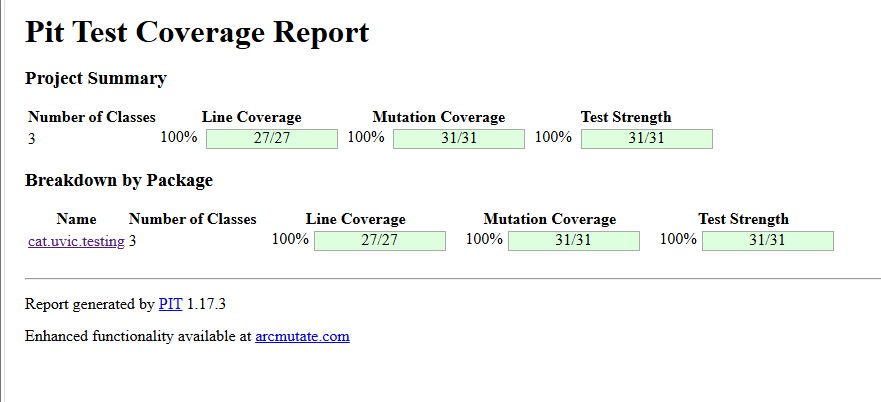

Arreglades:
Afegir un premium sense descompte sense arribar a 100

Part D
- Mutants sobrevivents
+---------------------------+---------------------------------------------+----------+---------------------------------------------------------+-------------------------------------------------+
|Classe i Línia             | Mutant introduït per PIT                    | Estat    | Per què ha sobreviscut? (Basat en els tests)            | Acció per matar-lo                              |
+---------------------------+---------------------------------------------+----------+---------------------------------------------------------+-------------------------------------------------+
|Calculator (Línia 14)      |Replaced int return with 0 for... multiplica | Survived | PIT ha canviat el codi intern perquè la                 | Afegir un test de multiplicació amb valors      |
|                           |                                             |          | multiplicació retorni sempre 0. Ha sobreviscut          | diferents de zero (ex: 3 * 5 = 15).             |
|                           |                                             |          | perquè l'únic test que teníem per a aquesta             |                                                 |
|                           |                                             |          | funció era 5 * 0, que espera 0 com a resultat.          |                                                 |
|                           |                                             |          | Com que el test esperava 0 i el mutant retorna 0,       |                                                 |
|                           |                                             |          | el test ha passat en verd sense adonar-se de la trampa. |                                                 |
+---------------------------+---------------------------------------------+----------+---------------------------------------------------------+-------------------------------------------------+
|DescompteService (Línia 7) | Changed conditional boundary                | Survived | PIT ha canviat la condició importCompra < 0 per         | Afegir el valor límit 0.0 al test parametritzat |
|                           |                                             |          | importCompra <= 0. Ha sobreviscut perquè teníem un test | esperant que retorni 0.0 sense llançar excepció |
|                           |                                             |          | per a -1 (que llança excepció) i un per a 50            |                                                 |
|                           |                                             |          | (cas normal), però no teníem cap test per al valor      |                                                 |
|                           |                                             |          | límit exacte 0.0.                                       |                                                 |
+---------------------------+---------------------------------------------+----------+---------------------------------------------------------+-------------------------------------------------+
                                                                                       

